```mermaid
---
config:
  look: neo
  layout: elk
  theme: neo
---
flowchart TD
  subgraph Accounts["Program Accounts"]
    VaultState["Vault State Account<br>(PDA: 'state' + user pubkey)"]
    VaultPDA["Vault PDA Account<br>(PDA: 'vault' + user pubkey)"]
  end

  subgraph Storage["Data & Value Storage"]
    VaultState --- StateBump["state_bump: u8"]
    VaultState --- VaultBump["vault_bump: u8"]
    VaultPDA --- SOLBalance["SOL Balance<br><i>stored as account lamports</i>"]
  end

  User("User Wallet") L_User_Initialize_0@-- "1.Initialize" --> Initialize["Initialize Instruction"]
  Initialize L_Initialize_VaultState_0@-- "1.1.Creates" --> VaultState
  Initialize L_Initialize_VaultPDA_0@-- "1.2.References" --> VaultPDA

  User L_User_Deposit_0@-- "2.Deposit" --> Deposit["Deposit Function"]
  Deposit L_Deposit_VaultPDA_0@-- "2.1.Transfers SOL" --> VaultPDA

  User L_User_Withdraw_0@-- "3.Withdraw" --> Withdraw["Withdraw Function"]
  Withdraw L_Withdraw_User_0@-- "3.2.Transfers SOL back" --> User
  VaultPDA L_VaultPDA_Withdraw_0@-- "3.1.SOL flows from" --> Withdraw
  Withdraw -.-> |"<i>Uses bump for security</i>"| VaultState

  User L_User_Close_0@-- "4.Close" --> Close["Close Instruction"]
  Close L_Close_User_0@-- "4.2.Withdraws all SOL" --> User
  Close L_Close_VaultState_0@-- "4.3.Closes account<br><i>reclaims rent</i>" --> VaultState
  VaultPDA L_VaultPDA_Close_0@-- "4.1.All funds returned" --> Close

  VaultState:::accountStyle
  VaultPDA:::accountStyle
  StateBump:::dataStyle
  VaultBump:::dataStyle
  SOLBalance:::nativeStyle
  User:::userStyle
  Initialize:::instructionStyle
  Deposit:::instructionStyle
  Withdraw:::instructionStyle
  Close:::instructionStyle
  Storage:::systemStyle

  classDef userStyle fill:#8FBC8F,stroke:#2E8B57,stroke-width:2px
  classDef instructionStyle fill:#FF9966,stroke:#FF6600,stroke-width:2px
  classDef accountStyle fill:#87CEFA,stroke:#1E90FF,stroke-width:2px
  classDef dataStyle fill:#E6E6FA,stroke:#9370DB,stroke-width:1px
  classDef nativeStyle fill:#FFE0B2,stroke:#FB8C00,stroke-width:1px
  classDef systemStyle fill:none,stroke:#CCCCCC,stroke-width:1px,stroke-dasharray: 5 5

  %% Data subgraph connections
  linkStyle 0,1,2 stroke:#CCCCCC,fill:none

  %% Initialize (Yellow)
  linkStyle 3,4,5 stroke:#FFD600,fill:none

  %% Deposit (Green)
  linkStyle 6,7 stroke:#00C853,fill:none

  %% Withdraw (Blue)
  linkStyle 8,9,10,11 stroke:#00BCD4,fill:none
  linkStyle 11 stroke:#00BCD4,stroke-dasharray: 3 3,fill:none

  %% Close (Red)
  linkStyle 12,13,14,15 stroke:#D50000,fill:none

  L_User_Initialize_0@{ animation: fast }
  L_Initialize_VaultState_0@{ animation: fast }
  L_Initialize_VaultPDA_0@{ animation: fast }
  L_User_Deposit_0@{ animation: fast }
  L_Deposit_VaultPDA_0@{ animation: fast }
  L_User_Withdraw_0@{ animation: fast }
  L_Withdraw_User_0@{ animation: fast }
  L_VaultPDA_Withdraw_0@{ animation: fast }
  L_User_Close_0@{ animation: fast }
  L_Close_User_0@{ animation: fast }
  L_Close_VaultState_0@{ animation: fast }
  L_VaultPDA_Close_0@{ animation: fast }
  ```
